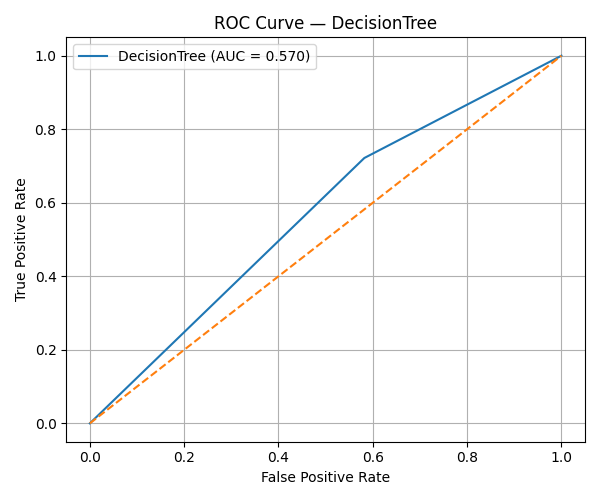
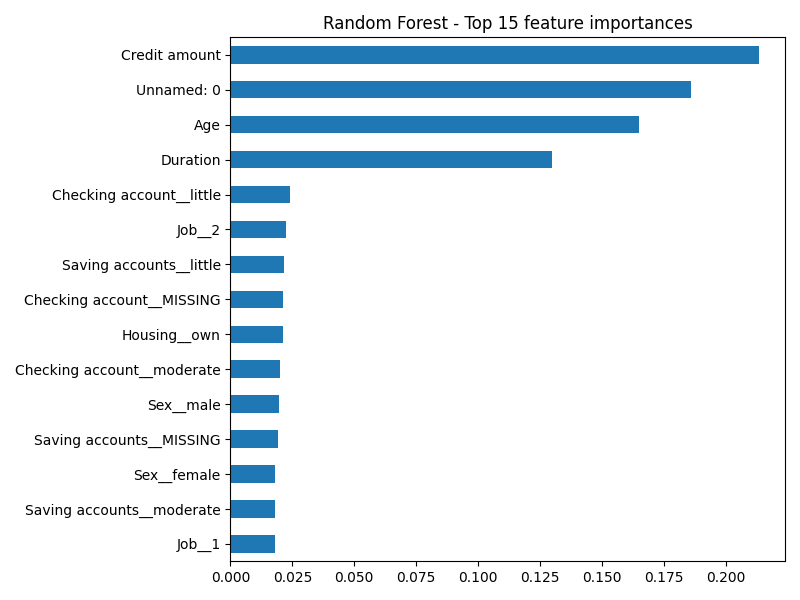
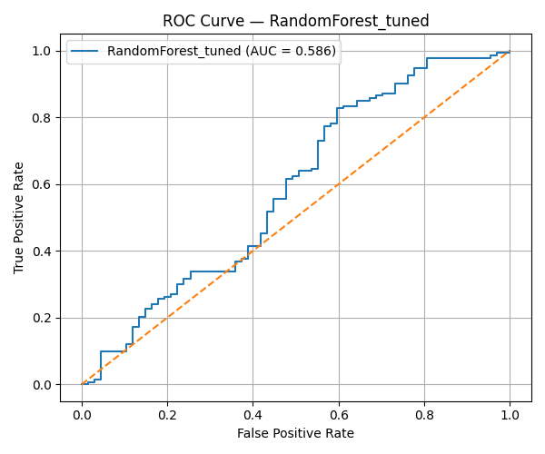
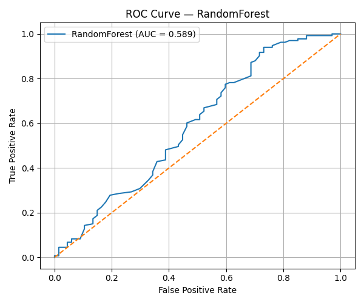
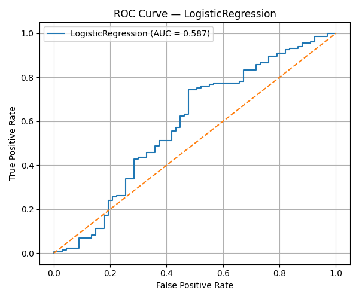

# Credit Scoring Model: German Credit Risk Dataset

This project implements a **Credit Scoring Model** to predict an individual’s creditworthiness using historical financial and demographic data. The model classifies applicants as **good** or **bad** credit risks using supervised machine learning techniques.

The solution is built end-to-end, covering:
- Data preprocessing & feature engineering  
- Training multiple classification models  
- Model evaluation using industry-standard metrics  
- Model comparison and selection  
- Saving trained models for reuse  

Dataset used: **German Credit Risk Dataset (Kaggle):** https://www.kaggle.com/datasets/uciml/german-credit

---

## Results








## 🎯 Objective
To accurately predict whether a loan applicant is a **high-risk (bad)** or **low-risk (good)** borrower using past financial behavior and personal attributes.

---

## 🧠 Models Implemented
The following classification algorithms are trained and evaluated:

- **Logistic Regression**
- **Decision Tree Classifier**
- **Random Forest Classifier**

---

## 📊 Evaluation Metrics
Each model is evaluated using:

- **Precision**
- **Recall**
- **F1-Score**
- **ROC-AUC**
- **Confusion Matrix**
- **ROC Curve**

The **best-performing model** is selected based on **ROC-AUC score**.

---

## 🗂️ Dataset Description
**German Credit Risk Dataset (Kaggle)**  
Each row represents a loan applicant with features such as:

- Age  
- Sex  
- Job  
- Housing  
- Saving accounts  
- Checking account  
- Credit amount  
- Duration  
- Purpose  
- Risk (Target Variable)

**Target Variable**
- `0` → Good credit risk  
- `1` → Bad credit risk  

---

## 🛠️ Technologies Used
- **Python 3**
- **Pandas / NumPy**
- **Scikit-learn**
- **Matplotlib**
- **Joblib**

---

## 📁 Project Structure
```text
credit-scoring-model/
│
├── credit_scoring_model.ipynb
├── results/
│   ├── roc_Logistic_Regression.png
│   ├── roc_Decision_Tree.png
│   ├── roc_Random_Forest.png
│   └── Random_Forest.joblib
│
└── README.md
